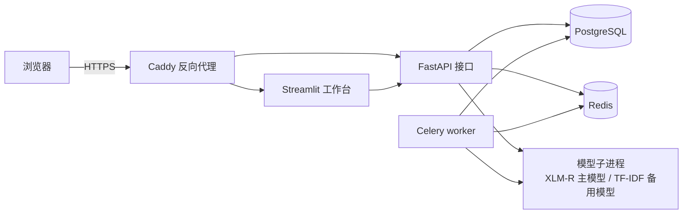

# InvoiceOps 发票工单智能分类与复核工作台

InvoiceOps 用于处理中英文混合的供应商邮件和付款工单，例如价格不符、重复开票、银行账户变更。系统会自动识别工单涉及的问题类别（同一工单可以同时属于多个类别），并把低置信度或高风险的工单交给人工复核。项目覆盖从数据校验、模型训练与评估，到在线服务、批量处理、人工复核、权限审计和 HTTPS 局域网部署的完整流程。

## 主要功能

- **单条分类**：粘贴一段工单文本，返回八个类别的概率、命中标签、是否需要复核及原因，以及实际使用的模型和阈值版本。
- **CSV 批量分类**：上传 CSV 后由后台 worker 逐行分类，可查看进度，下载结果和错误清单，需要复核的行自动进入复核队列。
- **人工复核**：所有有效用户都可以在“待复核工单”页面确认或修正模型标签。复核使用版本号做并发控制，避免多人重复处理同一工单。
- **我的历史**：查看自己提交的工单及其复核结果，以及自己处理过的复核。
- **管理员后台**：管理用户与角色；新增、修改、删除工单、分类记录和批次（支持一次删除 1–500 条）；对工单重新分类；查看预测历史、复核决定和审计日志。
- **主备模型自动切换**：主模型 XLM-R 故障或超时时，自动切换到 TF-IDF 备用模型，结果标记为降级并进入复核。两个模型都不可用时停止自动分类。
- **账号与安全**：用户自助注册后为普通用户，登录会话有效期 12 小时，刷新浏览器可通过 Cookie 恢复会话。密码使用 Argon2 哈希存储，登录和注册按邮箱与 IP 限流。指标接口 `/metrics` 仅管理员可访问。

## 分类标签

标签定义和顺序固定在 `configs/taxonomy.json`（版本 `invoiceops-v1`）：

| 标签 | 含义 |
|---|---|
| `DUPLICATE_INVOICE` | 重复开票或重复付款 |
| `MISSING_PO_OR_RECEIPT` | 缺少采购订单或收货凭证 |
| `OTHER_REVIEW` | 其他需要人工判断的问题 |
| `PAYMENT_STATUS` | 付款进度查询 |
| `PRICE_VARIANCE` | 发票单价与采购订单不符 |
| `QUANTITY_RECEIPT_VARIANCE` | 开票数量与收货数量不符 |
| `SUPPLIER_MASTER_CHANGE` | 供应商主数据（如收款银行账户）变更 |
| `TAX_CURRENCY_AMOUNT` | 税额、币种或金额合计有误 |

## 复核规则

每个标签有独立阈值，概率不低于阈值即判为命中。出现以下任一情况时，工单状态为 `pending_review`（待复核），否则为 `not_required`：

| 原因 | 触发条件 |
|---|---|
| `supplier_master_change` | 命中供应商主数据变更（高风险，需人工确认） |
| `no_label` | 没有任何标签达到阈值 |
| `low_confidence` | 任一标签的概率与阈值相差不超过 0.05 |
| `model_fallback` | 本次由备用模型完成分类 |

## 系统架构



- **proxy**：Caddy 2.10，使用本地 CA 签发证书，是唯一映射到宿主机的服务。
- **web**：Streamlit 工作台，通过内部网络调用 API。
- **api**：FastAPI 接口。启动时自动执行 Alembic 数据库迁移。
- **worker**：Celery worker（`solo` 池，并发 1），带定时扫描，负责批量任务，重启后可继续处理未完成的批次。
- **postgres / redis**：业务数据与任务队列，数据保存在持久卷中。
- **模型运行时**：模型在受监督的独立子进程中加载和推理，启动和单次推理都有超时（默认 180 秒和 10 秒），故障后自动切换备用模型。

## 技术栈

| 类别 | 技术 |
|---|---|
| 语言 | Python 3.11 |
| 接口与前端 | FastAPI、Uvicorn、Streamlit |
| 任务与存储 | Celery、Redis、PostgreSQL 17、SQLAlchemy 2、Alembic |
| 机器学习 | PyTorch（CPU）、Transformers、XLM-RoBERTa、scikit-learn（TF-IDF） |
| 安全 | Argon2 密码哈希、会话令牌、按角色授权、审计日志 |
| 部署 | Docker Compose、Caddy（HTTPS） |
| 依赖管理 | uv（`uv.lock` 锁定版本） |

## 目录结构

```text
.
├── apps/
│   ├── api/main.py          # FastAPI 接口
│   ├── web/                 # Streamlit 工作台（页面、接口客户端、会话 Cookie 组件）
│   └── worker/tasks.py      # Celery 批量任务
├── src/invoiceops/
│   ├── adapters/            # 数据库模型与存取
│   ├── application/         # 分类与复核规则、CSV 批量解析
│   ├── data/                # 数据契约与三份数据集的校验
│   ├── ml_runtime/          # 模型加载、校验与子进程监督
│   ├── observability/       # 运行指标
│   └── security/            # 认证、密码规则、授权
├── ml/
│   ├── training.py          # TF-IDF / XLM-R 训练
│   ├── evaluate.py          # 模型评估
│   ├── artifact_card.py     # 模型卡生成
│   ├── benchmark*.py, capacity_*loadgen.py   # 性能与容量压测
│   └── gates/               # 质量与容量门槛
├── configs/taxonomy.json    # 标签定义
├── data/                    # 训练 / 开发 / 测试数据
├── infra/
│   ├── caddy/               # Caddy 配置
│   └── migrations/          # Alembic 数据库迁移
├── tests/                   # 自动化测试
├── compose.yaml             # 部署编排
├── Dockerfile               # 应用镜像
└── Dockerfile.runtime-patch # 只更新代码层的快速构建
```

## 数据集

项目数据为网上开源获取，仅供参考。共 6,000 条中文、英文和中英混合的工单文本，来源渠道为邮件和供应商门户，按分组切分为三份：

| 文件 | 行数 |
|---|---|
| `data/invoiceops_train.csv` | 4,372 |
| `data/invoiceops_dev.csv` | 781 |
| `data/invoiceops_test.csv` | 847 |

主要字段：`request_id`、`source`、`text`（已脱敏）、`language`（`zh` / `en` / `mixed`）、`labels`，以及用于防止切分泄漏的分组字段。训练只使用 `text`。数据校验器会检查字段结构、标签合法性、空值、跨切分的文本与分组泄漏，并记录各文件的 SHA-256。详见 [`data/README.md`](data/README.md)。

## 模型与评估结果

| 模型 | 角色 | 测试集 macro-F1 | 测试集 micro-F1 | 供应商变更召回率 | 中英 macro-F1 差距 |
|---|---|---|---|---|---|
| XLM-R（`xlmr-v2`） | 主模型 | 1.000 | 1.000 | 1.000 | 0.000 |
| TF-IDF（`tfidf-v2`） | 备用模型 | 0.997 | 0.997 | 1.000 | 0.005 |

质量门槛见 `ml/gates/engineering-quality-v1.json`：macro-F1 ≥ 0.80，micro-F1 ≥ 0.85，`SUPPLIER_MASTER_CHANGE` 召回率 ≥ 0.95，中英文 macro-F1 差距 ≤ 0.08。两个模型均达标。

模型产物带有 manifest 和模型卡。服务加载模型前会校验文件哈希、标签顺序和阈值，校验不通过的模型不会上线。训练、评估与压测说明见 [`ml/README.md`](ml/README.md)。

## 快速开始

### 本地开发与测试

需要 Python 3.11 和 [uv](https://docs.astral.sh/uv/)。

```powershell
uv sync --frozen          # 安装锁定依赖
uv run pytest tests -q    # 运行全部测试
```

数据校验：

```powershell
uv run python -m invoiceops.data --train data/invoiceops_train.csv --dev data/invoiceops_dev.csv --test data/invoiceops_test.csv --manifest ml/data_manifest.json
```

### 训练模型

```powershell
# TF-IDF 备用模型
uv run python -m ml.training train-tfidf --train data/invoiceops_train.csv --dev data/invoiceops_dev.csv --test data/invoiceops_test.csv --output ml/artifacts/tfidf-new

# XLM-R 主模型
uv run python -m ml.training train-xlmr --train data/invoiceops_train.csv --dev data/invoiceops_dev.csv --test data/invoiceops_test.csv --base-model ml/pretrained/xlm-roberta-base --base-revision e73636d4f797dec63c3081bb6ed5c7b0bb3f2089 --output ml/artifacts/xlmr-new
```

预训练模型（约 2 GB）和训练产物 `ml/artifacts/` 体积较大，不纳入版本库。预训练模型请从 HuggingFace 下载 [`FacebookAI/xlm-roberta-base`](https://huggingface.co/FacebookAI/xlm-roberta-base)（提交 `e73636d4f797dec63c3081bb6ed5c7b0bb3f2089`），放到 `ml/pretrained/xlm-roberta-base/`。训练时每次使用新的输出目录。

### Docker 部署（局域网 HTTPS）

1. 复制 `.env.example` 为 `.env`，并修改：
   - `POSTGRES_PASSWORD`：数据库密码，请使用随机强密码；
   - `INVOICEOPS_HOST`：本机局域网 IP 或可解析的主机名，会写入 HTTPS 证书；
   - `INVOICEOPS_BIND_ADDRESS`、`INVOICEOPS_HTTPS_PORT`：监听地址与端口（默认 `127.0.0.1:8443`，仅本机可访问；设为 `0.0.0.0` 则所有网卡都可访问）。

   确认 `ml/artifacts/` 下已有 `xlmr-v2` 和 `tfidf-v2` 两个模型产物，部署时它们以只读方式挂载进容器。

2. 启动服务：

   ```powershell
   docker compose config --quiet
   docker compose up --build -d
   ```

3. 默认管理员：`INVOICEOPS_DEMO_MODE=true`（默认）时，如果数据库中还没有管理员，API 启动时会自动创建 `admin@example.local` / `InvoiceopsDemo2026`。正式使用前，建议在首次启动前通过 `.env` 的 `INVOICEOPS_DEMO_ADMIN_EMAIL` 和 `INVOICEOPS_DEMO_ADMIN_PASSWORD` 设置自己的管理员账号。已有管理员不会被覆盖。也可以手动创建：

   ```powershell
   docker compose exec api python -m invoiceops.security.auth --email admin@example.local
   ```

4. 信任 HTTPS 证书：导出 Caddy 本地 CA 根证书，在需要访问的设备上安装。

   ```powershell
   docker compose cp proxy:/data/caddy/pki/authorities/local/root.crt .\infra\caddy\root.crt
   certutil -user -addstore Root .\infra\caddy\root.crt
   ```

   然后访问 `https://<INVOICEOPS_HOST>:<INVOICEOPS_HTTPS_PORT>/`。`root.crt` 是公开证书，可以复制到其他设备，但不要分发 CA 私钥。

5. 健康检查：`/healthz` 检查进程，`/readyz` 检查数据库与可用模型。

6. 切换网络（有线/无线/热点）：本机始终可以用 `https://localhost:8443/` 访问。下面的脚本会检测当前已连接的网卡：把 `INVOICEOPS_ALLOWED_HOSTS` 设为 `localhost` 加上这些网卡的 IP（未连接网卡的 IP 返回 421），把 `INVOICEOPS_HOST`（证书地址）设为当前上网网卡的 IP（完全断网时为 `127.0.0.1`），并设置 `INVOICEOPS_BIND_ADDRESS=0.0.0.0`；同时用 Caddy 本地根证书签发一张包含 `localhost`、`127.0.0.1` 和这些 IP 的证书（`infra/caddy/certs/site.pem`），多个网卡同时连接时每个地址都没有证书提示，已导入的 `root.crt` 仍然有效。配置有变化时只重建或重启 `proxy` 容器：

   ```powershell
   .\refresh_frontend_address.ps1                  # 检测并按需更新
   .\refresh_frontend_address.ps1 -DryRun          # 只显示检测结果
   .\refresh_frontend_address.ps1 -InstallAutoRun  # 登录及网络变化时自动运行
   .\refresh_frontend_address.ps1 -UninstallAutoRun
   ```

   其他设备要访问，还需要 Windows 防火墙放行该端口的入站连接。

只更新应用代码时，可以复用已有的依赖镜像快速构建：

```powershell
docker build -f Dockerfile.runtime-patch -t invoiceops-api:latest .
docker tag invoiceops-api:latest invoiceops-web:latest
docker tag invoiceops-api:latest invoiceops-worker:latest
docker compose up -d --no-build api worker web
```

## 配置项

| 环境变量 | 说明 | 默认值 |
|---|---|---|
| `POSTGRES_PASSWORD` | PostgreSQL 密码 | 必填 |
| `INVOICEOPS_HOST` | 访问用主机名或 IP，会写入证书 | 必填 |
| `INVOICEOPS_BIND_ADDRESS` | HTTPS 监听地址；`0.0.0.0` 表示所有网卡 | 必填 |
| `INVOICEOPS_HTTPS_PORT` | HTTPS 端口 | `8443` |
| `INVOICEOPS_ALLOWED_HOSTS` | 网关放行的主机名/IP（空格分隔），其余返回 421 | `localhost` 和任意 IPv4 |
| `INVOICEOPS_DEMO_MODE` | 为 `true` 时，校验通过的模型无需 `approval.json` 即可上线，并自动创建默认管理员；为 `false` 时模型需要 `approval.json` | `true` |
| `INVOICEOPS_DEMO_ADMIN_EMAIL` / `INVOICEOPS_DEMO_ADMIN_PASSWORD` | 默认管理员账号 | `admin@example.local` / `InvoiceopsDemo2026` |
| `INVOICEOPS_PRIMARY_MODEL` / `INVOICEOPS_FALLBACK_MODEL` | 主、备模型目录 | `ml/artifacts/xlmr-v2` / `ml/artifacts/tfidf-v2` |
| `INVOICEOPS_MODEL_DEVICE` | 推理设备 | `cpu` |
| `INVOICEOPS_MODEL_INFERENCE_TIMEOUT_SECONDS` | 单次推理超时（秒） | `10` |
| `INVOICEOPS_MODEL_STARTUP_TIMEOUT_SECONDS` | 模型启动超时（秒） | `180` |

**密码规则**：新设置的密码（注册、管理员新建用户、默认管理员）须为 12–64 位英文字母和数字组合，且至少各含一个字母和一个数字。已有账号的旧密码不受影响。

**CSV 批量上传限制**：UTF-8 编码，必须有 `text` 列，可选 `external_id` 列；文件不超过 10 MiB，最多 10,000 行，单行文本不超过 10,000 字符。

## API 概览

除健康检查、注册和登录外，其他接口都需要携带登录令牌。

| 分组 | 接口 |
|---|---|
| 健康检查 | `GET /healthz`、`GET /readyz` |
| 认证 | `POST /v1/auth/register`、`POST /v1/auth/login`、`POST /v1/auth/logout`、`GET /v1/auth/me` |
| 分类 | `POST /v1/classifications`、`GET /v1/classifications` |
| 批量 | `POST /v1/batches`、`GET /v1/batches`、`GET /v1/batches/{id}`、`GET /v1/batches/{id}/download`、`GET /v1/batches/{id}/errors` |
| 复核 | `GET /v1/reviews/queue`、`GET /v1/reviews/history`、`POST /v1/reviews/{ticket_id}` |
| 管理员 | `/v1/admin/users`、`/v1/admin/tickets`（含 `/{id}/reclassify`）、`/v1/admin/predictions`、`/v1/admin/batches`、`GET /v1/admin/history` |
| 指标 | `GET /metrics`（仅管理员） |

## 运维

- `docker compose ps` 查看服务状态；`docker compose logs api worker proxy` 查看日志，日志中不含工单明文。
- 批量任务每一行按“批次 ID + 行号”幂等处理，worker 重启后会继续处理未完成的批次。
- PostgreSQL、Redis 与 Caddy 证书数据保存在持久卷中，删除卷会丢失业务数据和证书。
- 管理员删除工单、分类记录或批次后，`/v1/admin/history` 仍会保留预测历史、复核决定和审计记录。
- 性能压测脚本：`run_capacity_benchmark.ps1`、`run_compose_capacity_benchmark.ps1`、`run_fullstack_capacity_benchmark.ps1`，门槛配置见 `ml/gates/`。
